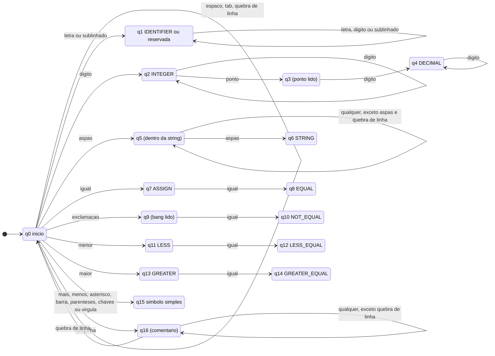
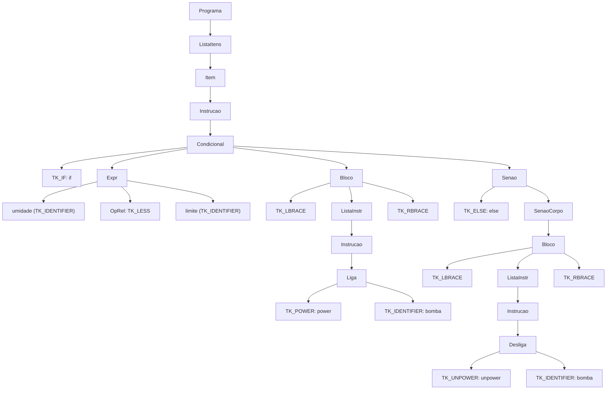

# MineC — Documentação da Linguagem

**Disciplina:** Linguagens Formais e Compiladores
**Tema:** Linguagem para programar uma fazenda automática simulada, estilo Minecraft
**Escopo desta entrega:** definição da linguagem, análise léxica e análise sintática.

Documentos relacionados: [Tabela de Tokens](tabela-de-tokens.md) · [Exemplos de programas](../exemplos/)

---

## Sumário
1. [Visão geral da linguagem](#1-visão-geral-da-linguagem)
2. [Análise léxica](#2-análise-léxica)
3. [Análise sintática](#3-análise-sintática)
4. [Regras semânticas (informais)](#4-regras-semânticas-informais)
5. [Implementação e verificação da gramática](#5-implementação-e-verificação-da-gramática)
6. [Material sugerido para o Figma](#6-material-sugerido-para-o-figma)

---

## 1. Visão geral da linguagem

MineC é uma linguagem imperativa, pequena e de leitura fácil, criada para descrever o comportamento de uma fazenda automática simulada: ela **lê sensores** (umidade, temperatura), **decide** com condições e laços e **aciona atuadores** (bomba de água, ventilador). Sensores e atuadores são conceitos da própria linguagem; o projeto não depende de nenhum hardware. As palavras-chave usam o vocabulário do Minecraft:

| Conceito | Palavra MineC | Ideia no Minecraft |
|---|---|---|
| Variável | `craft` | fabricar algo |
| Sensor | `observer` | bloco Observer |
| Atuador | `lever` | alavanca |
| Ler sensor | `mine` | minerar um dado |
| Ligar / desligar | `power` / `unpower` | energizar redstone |
| Função | `command` | bloco de comando |
| Retorno | `drop` | item dropado |
| Saída | `say` | chat |

### Características
- **Sem terminador de instrução** (não usa `;`); espaços e quebras de linha só separam tokens.
- **Blocos com chaves** `{ ... }`.
- **Tipos** (verificados na fase semântica): inteiro, decimal, texto e booleano.
- **Funções** (`command`) só no nível global; podem ter parâmetros e retornar valor com `drop`.
- **Comentários** de linha com `#`.
- **Sensibilidade a maiúsculas:** `Craft` não é `craft` (é um identificador).

### Programa mínimo
```minec
# Irrigação automática
observer umidade = 34
lever bomba = 8

mine umidade
if umidade < 30 {
    power bomba
    wait 10
    unpower bomba
}
```

Mais exemplos completos em [`exemplos/`](../exemplos/).

---

## 2. Análise léxica

O analisador léxico (*scanner*) lê o código-fonte como uma sequência de caracteres e produz uma sequência de **tokens**, descartando espaços e comentários. Os padrões usados são **linguagens regulares**, descritas abaixo por expressões regulares e por um **autômato finito determinístico (AFD)**.

### 2.1 Alfabeto

Σ = letras ASCII (`A–Z`, `a–z`), dígitos (`0–9`), `_`, os símbolos `+ - * / = < > ! ( ) { } , " #`, espaço, tab, `\r`, `\n`. Dentro de **strings** e **comentários** qualquer caractere Unicode é aceito (ex.: acentos).

### 2.2 Definições regulares auxiliares

```
letra   = [A-Za-z_]
digito  = [0-9]
espaco  = [ \t\r\n]
```

### 2.3 Expressões regulares dos tokens

| Token(s) | Expressão regular |
|---|---|
| `TK_IDENTIFIER` | `letra (letra \| digito)*` |
| `TK_INTEGER` | `digito+` |
| `TK_DECIMAL` | `digito+ "." digito+` |
| `TK_STRING` | `"\"" [^"\n]* "\""` |
| `TK_ASSIGN` | `=` |
| `TK_EQUAL` | `==` |
| `TK_NOT_EQUAL` | `!=` |
| `TK_LESS` / `TK_GREATER` | `<` / `>` |
| `TK_LESS_EQUAL` / `TK_GREATER_EQUAL` | `<=` / `>=` |
| `TK_PLUS`, `TK_MINUS`, `TK_STAR`, `TK_SLASH` | `+`, `-`, `*`, `/` |
| `TK_LPAREN`, `TK_RPAREN`, `TK_LBRACE`, `TK_RBRACE`, `TK_COMMA` | `(`, `)`, `{`, `}`, `,` |
| Ignorados: espaço | `espaco+` |
| Ignorados: comentário | `"#" [^\n]*` |

As **palavras reservadas** (`craft mine say if else while repeat power unpower wait observer lever command drop and or not`) e os **booleanos** (`true false`) têm como expressão regular o próprio lexema (ex.: `craft`). Na prática elas não entram no autômato como caminhos separados: ver regra 3 abaixo.

Lista completa de tokens em [tabela-de-tokens.md](tabela-de-tokens.md).

### 2.4 Regras de reconhecimento

1. **Maior casamento (*maximal munch*)**: o scanner consome o **maior lexema possível**. `<=` é um token (`TK_LESS_EQUAL`), não `<` seguido de `=`; `limite2` é um só identificador.
2. **Sem sinal nos números**: `-` é sempre `TK_MINUS`. Números negativos são tratados pela gramática (operador unário). Assim `x-1` vira `x`, `-`, `1`.
3. **Palavras reservadas por tabela**: o scanner reconhece primeiro um identificador (`letra (letra|digito)*`) e depois consulta a **tabela de palavras reservadas**. Se o lexema estiver na tabela, o token é o da palavra reservada; senão, `TK_IDENTIFIER`. Por isso `craft` é `TK_CRAFT`, mas `craftar` é `TK_IDENTIFIER`.
4. **Tokens ignorados**: espaços, quebras de linha e comentários não geram tokens.
5. **Fim de arquivo**: ao acabar a entrada, o scanner emite `TK_EOF`.

### 2.5 Autômato finito determinístico

AFD **M = (Q, Σ, δ, q0, F)** com um estado inicial `q0`; os estados finais retornam o token indicado.



**Estados finais F** e o token retornado:

| Estado | Token | Observação |
|---|---|---|
| `q1` | `TK_IDENTIFIER` ou palavra reservada / `true` / `false` | decidido pela tabela de reservadas (regra 3) |
| `q2` | `TK_INTEGER` | |
| `q4` | `TK_DECIMAL` | |
| `q6` | `TK_STRING` | |
| `q7` | `TK_ASSIGN` | vira `q8` se vier outro `=` |
| `q8` | `TK_EQUAL` | |
| `q10` | `TK_NOT_EQUAL` | |
| `q11` | `TK_LESS` | vira `q12` se vier `=` |
| `q12` | `TK_LESS_EQUAL` | |
| `q13` | `TK_GREATER` | vira `q14` se vier `=` |
| `q14` | `TK_GREATER_EQUAL` | |
| `q15` | `TK_PLUS`, `TK_MINUS`, `TK_STAR`, `TK_SLASH`, `TK_LPAREN`, `TK_RPAREN`, `TK_LBRACE`, `TK_RBRACE`, `TK_COMMA` | um estado por símbolo no autômato completo (aqui agrupados) |

Estados **não finais** (`q3`, `q5`, `q9`, `q16`) exigem mais caracteres. Se a entrada acabar ou surgir um caractere sem transição neles, ocorre **erro léxico**. Nos estados finais que podem continuar (`q1`, `q2`, `q4`, `q7`, `q11`, `q13`), quando não existe transição para o próximo caractere, o scanner **aceita o lexema atual e devolve o caractere** para a próxima leitura (*retrocesso de um caractere*).

### 2.6 Exemplo de tokenização

Entrada:
```minec
craft limite = 30
if umidade <= 32.5 and not bomba {
    say "Seco" # aviso
}
```

Saída do scanner (o comentário e os espaços são descartados):

| # | Token | Lexema |
|---|---|---|
| 1 | `TK_CRAFT` | `craft` |
| 2 | `TK_IDENTIFIER` | `limite` |
| 3 | `TK_ASSIGN` | `=` |
| 4 | `TK_INTEGER` | `30` |
| 5 | `TK_IF` | `if` |
| 6 | `TK_IDENTIFIER` | `umidade` |
| 7 | `TK_LESS_EQUAL` | `<=` |
| 8 | `TK_DECIMAL` | `32.5` |
| 9 | `TK_AND` | `and` |
| 10 | `TK_NOT` | `not` |
| 11 | `TK_IDENTIFIER` | `bomba` |
| 12 | `TK_LBRACE` | `{` |
| 13 | `TK_SAY` | `say` |
| 14 | `TK_STRING` | `"Seco"` |
| 15 | `TK_RBRACE` | `}` |
| 16 | `TK_EOF` | |

### 2.7 Erros léxicos

| Situação | Exemplo | Mensagem sugerida |
|---|---|---|
| Caractere fora do alfabeto | `craft x = 3 @ 2` | `linha 1: caractere inválido '@'` |
| `!` sem `=` | `craft x = !3` | `linha 1: caractere inválido '!'` (negação é `not`) |
| String não fechada | `say "Olá` | `linha 1: string não fechada` |
| Decimal incompleto | `craft x = 3.` | `linha 1: decimal malformado` |
| Acento em identificador | `craft umidáde = 1` | `linha 1: caractere inválido 'á'` |

Observação: `3abc` **não** é erro léxico; pelo maior casamento vira `TK_INTEGER(3)` + `TK_IDENTIFIER(abc)` e o erro aparece na análise sintática.

---

## 3. Análise sintática

O analisador sintático (*parser*) recebe os tokens e verifica se formam um programa válido segundo uma **gramática livre de contexto (GLC)**. A gramática da MineC foi escrita para ser **LL(1)**, o que permite um **analisador preditivo descendente** (descida recursiva ou tabela LL(1)) sem retrocesso.

### 3.1 Definição formal

**G = (V, T, P, S)**

- **V** (não terminais): `Programa`, `ListaItens`, `Item`, `Comando`, `Params`, `ParamsR`, `Bloco`, `ListaInstr`, `Instrucao`, `DeclVar`, `DeclSensor`, `DeclAtuador`, `InstrId`, `InstrIdR`, `Leitura`, `Saida`, `Condicional`, `Senao`, `SenaoCorpo`, `Enquanto`, `Repita`, `Liga`, `Desliga`, `Espera`, `Retorno`, `Args`, `ArgsR`, `Expr`, `ExprR`, `Conj`, `ConjR`, `Igual`, `IgualR`, `OpIgual`, `Rel`, `RelR`, `OpRel`, `Soma`, `SomaR`, `OpSoma`, `Termo`, `TermoR`, `OpMul`, `Unario`, `Primario`, `ChamadaOpc`.
- **T** (terminais): os 39 tokens de linguagem + `TK_EOF` (ver [tabela de tokens](tabela-de-tokens.md)).
- **S** (símbolo inicial): `Programa`.
- **P**: produções abaixo. `ε` é a palavra vazia.

### 3.2 Produções (BNF)

**Estrutura do programa**
```
Programa     → ListaItens
ListaItens   → Item ListaItens | ε
Item         → Comando | Instrucao
Comando      → TK_COMMAND TK_IDENTIFIER TK_LPAREN Params TK_RPAREN Bloco
Params       → TK_IDENTIFIER ParamsR | ε
ParamsR      → TK_COMMA TK_IDENTIFIER ParamsR | ε
Bloco        → TK_LBRACE ListaInstr TK_RBRACE
ListaInstr   → Instrucao ListaInstr | ε
```

**Instruções**
```
Instrucao    → DeclVar | DeclSensor | DeclAtuador | InstrId | Leitura | Saida
             | Condicional | Enquanto | Repita | Liga | Desliga | Espera | Retorno

DeclVar      → TK_CRAFT    TK_IDENTIFIER TK_ASSIGN Expr
DeclSensor   → TK_OBSERVER TK_IDENTIFIER TK_ASSIGN Expr
DeclAtuador  → TK_LEVER    TK_IDENTIFIER TK_ASSIGN Expr

InstrId      → TK_IDENTIFIER InstrIdR
InstrIdR     → TK_ASSIGN Expr                       (atribuição)
             | TK_LPAREN Args TK_RPAREN             (chamada de comando)

Leitura      → TK_MINE TK_IDENTIFIER
Saida        → TK_SAY Expr
Liga         → TK_POWER TK_IDENTIFIER
Desliga      → TK_UNPOWER TK_IDENTIFIER
Espera       → TK_WAIT Expr
Retorno      → TK_DROP Expr

Condicional  → TK_IF Expr Bloco Senao
Senao        → TK_ELSE SenaoCorpo | ε
SenaoCorpo   → Condicional | Bloco                  (permite "else if")
Enquanto     → TK_WHILE Expr Bloco
Repita       → TK_REPEAT Expr Bloco

Args         → Expr ArgsR | ε
ArgsR        → TK_COMMA Expr ArgsR | ε
```

**Expressões** (uma regra por nível de precedência, da menor para a maior)
```
Expr         → Conj ExprR
ExprR        → TK_OR Conj ExprR | ε

Conj         → Igual ConjR
ConjR        → TK_AND Igual ConjR | ε

Igual        → Rel IgualR
IgualR       → OpIgual Rel IgualR | ε
OpIgual      → TK_EQUAL | TK_NOT_EQUAL

Rel          → Soma RelR
RelR         → OpRel Soma RelR | ε
OpRel        → TK_LESS | TK_GREATER | TK_LESS_EQUAL | TK_GREATER_EQUAL

Soma         → Termo SomaR
SomaR        → OpSoma Termo SomaR | ε
OpSoma       → TK_PLUS | TK_MINUS

Termo        → Unario TermoR
TermoR       → OpMul Unario TermoR | ε
OpMul        → TK_STAR | TK_SLASH

Unario       → TK_NOT Unario | TK_MINUS Unario | Primario

Primario     → TK_INTEGER | TK_DECIMAL | TK_STRING | TK_TRUE | TK_FALSE
             | TK_IDENTIFIER ChamadaOpc
             | TK_LPAREN Expr TK_RPAREN
ChamadaOpc   → TK_LPAREN Args TK_RPAREN | ε
```

### 3.3 Precedência e associatividade

Da **menor** para a **maior** precedência (a cascata de regras acima já impõe essa ordem):

| Nível | Operadores | Associatividade |
|---|---|---|
| 1 | `or` | esquerda |
| 2 | `and` | esquerda |
| 3 | `==` `!=` | esquerda |
| 4 | `<` `>` `<=` `>=` | esquerda |
| 5 | `+` `-` | esquerda |
| 6 | `*` `/` | esquerda |
| 7 | `not` `-` (unários) | direita |
| 8 | `( )` agrupamento e chamada `f(...)` | — |

Exemplo: `a + b * 2 < c and not d` é lido como `((a + (b * 2)) < c) and (not d)`.

### 3.4 Conjuntos FIRST e FOLLOW

Abreviações usadas nas tabelas:

- `FIRST(Instrucao)` = { `TK_CRAFT`, `TK_OBSERVER`, `TK_LEVER`, `TK_IDENTIFIER`, `TK_MINE`, `TK_SAY`, `TK_IF`, `TK_WHILE`, `TK_REPEAT`, `TK_POWER`, `TK_UNPOWER`, `TK_WAIT`, `TK_DROP` }
- `FIRST(Expr)` = { `TK_INTEGER`, `TK_DECIMAL`, `TK_STRING`, `TK_TRUE`, `TK_FALSE`, `TK_IDENTIFIER`, `TK_LPAREN`, `TK_MINUS`, `TK_NOT` }
- `FOLLOW(Instrucao)` = `FIRST(Instrucao)` ∪ { `TK_COMMAND`, `TK_RBRACE`, `TK_EOF` }
- `FOLLOW(Expr)` = `FOLLOW(Instrucao)` ∪ { `TK_LBRACE`, `TK_COMMA`, `TK_RPAREN` }
- `OPS` = { `TK_EQUAL`, `TK_NOT_EQUAL`, `TK_LESS`, `TK_GREATER`, `TK_LESS_EQUAL`, `TK_GREATER_EQUAL`, `TK_AND`, `TK_OR` } (operadores de nível inferior, já consumidos antes)

**Não terminais que derivam ε** (os únicos que podem gerar problemas em LL(1)):

| Não terminal | FIRST (das alternativas não vazias) | FOLLOW |
|---|---|---|
| `Programa`, `ListaItens` | `FIRST(Instrucao)` ∪ { `TK_COMMAND` } | { `TK_EOF` } |
| `ListaInstr` | `FIRST(Instrucao)` | { `TK_RBRACE` } |
| `Params` | { `TK_IDENTIFIER` } | { `TK_RPAREN` } |
| `ParamsR` | { `TK_COMMA` } | { `TK_RPAREN` } |
| `Args` | `FIRST(Expr)` | { `TK_RPAREN` } |
| `ArgsR` | { `TK_COMMA` } | { `TK_RPAREN` } |
| `Senao` | { `TK_ELSE` } | `FOLLOW(Instrucao)` |
| `ExprR` | { `TK_OR` } | `FOLLOW(Expr)` |
| `ConjR` | { `TK_AND` } | { `TK_OR` } ∪ `FOLLOW(Expr)` |
| `IgualR` | { `TK_EQUAL`, `TK_NOT_EQUAL` } | { `TK_AND`, `TK_OR` } ∪ `FOLLOW(Expr)` |
| `RelR` | { `TK_LESS`, `TK_GREATER`, `TK_LESS_EQUAL`, `TK_GREATER_EQUAL` } | { `TK_EQUAL`, `TK_NOT_EQUAL`, `TK_AND`, `TK_OR` } ∪ `FOLLOW(Expr)` |
| `SomaR` | { `TK_PLUS`, `TK_MINUS` } | `OPS` ∪ `FOLLOW(Expr)` |
| `TermoR` | { `TK_STAR`, `TK_SLASH` } | { `TK_PLUS`, `TK_MINUS` } ∪ `OPS` ∪ `FOLLOW(Expr)` |
| `ChamadaOpc` | { `TK_LPAREN` } | { `TK_STAR`, `TK_SLASH`, `TK_PLUS`, `TK_MINUS` } ∪ `OPS` ∪ `FOLLOW(Expr)` |

**Demais não terminais** (alguns exemplos):

| Não terminal | FIRST |
|---|---|
| `Item` | `FIRST(Instrucao)` ∪ { `TK_COMMAND` } |
| `Comando` | { `TK_COMMAND` } |
| `Bloco` | { `TK_LBRACE` } |
| `InstrId` | { `TK_IDENTIFIER` } |
| `InstrIdR` | { `TK_ASSIGN`, `TK_LPAREN` } |
| `SenaoCorpo` | { `TK_IF`, `TK_LBRACE` } |
| `Expr`, `Conj`, `Igual`, `Rel`, `Soma`, `Termo`, `Unario` | `FIRST(Expr)` |
| `Primario` | `FIRST(Expr)` − { `TK_MINUS`, `TK_NOT` } |

### 3.5 Verificação LL(1)

Uma gramática é LL(1) se, para cada não terminal `A` com alternativas `A → α | β`:
1. `FIRST(α) ∩ FIRST(β) = ∅`, e
2. se `α ⇒* ε`, então `FIRST(β) ∩ FOLLOW(A) = ∅`.

- **Condição 1:** as alternativas de cada não terminal começam por terminais diferentes (`Instrucao`: cada alternativa inicia com uma palavra reservada distinta, exceto `InstrId`, o único que começa com `TK_IDENTIFIER`; `Primario`: um terminal distinto por alternativa; `Unario`: `TK_NOT`, `TK_MINUS` ou `FIRST(Primario)`, que não contém nenhum dos dois).
- **Condição 2:** para todo não terminal da tabela de ε acima, o FIRST da parte não vazia é **disjunto** do FOLLOW. Os casos que merecem atenção:
  - `SomaR` (FIRST contém `TK_MINUS`) e `ChamadaOpc` (FIRST = `TK_LPAREN`): nem `TK_MINUS` nem `TK_LPAREN` pertencem a `FOLLOW(Expr)`, pois **nenhuma instrução começa com `-` ou `(`**. Assim, a instrução da linha seguinte nunca é confundida com a continuação da expressão anterior.
  - `Senao` (FIRST = `TK_ELSE`): `TK_ELSE` não está em `FOLLOW(Instrucao)`; nenhuma instrução começa com `else`. Como os blocos usam chaves, **não existe o problema do *dangling else***: cada `else` pertence ao `if` do bloco imediatamente anterior.
  - `Args`: FIRST(Expr) é disjunto de `{ TK_RPAREN }`.

Resultado: **não há conflitos**; a tabela preditiva `M[A, a]` tem no máximo uma produção por célula.

### 3.6 Por que não há `;`

Com a gramática acima, o fim de uma instrução é sempre detectável por **um único token de lookahead**: uma expressão termina quando o próximo token não é operador binário nem `(`; a instrução seguinte começa sempre por palavra reservada ou identificador. O ponto e vírgula seria redundante. Ex.:

```minec
craft a = b
c = 3
```
Depois de `b`, o próximo token é `c` (`TK_IDENTIFIER`), que não continua a expressão. Logo, são duas instruções.

### 3.7 Exemplo de derivação

Programa:
```minec
if umidade < limite {
    power bomba
} else {
    unpower bomba
}
```

Árvore sintática (níveis intermediários de expressão foram colapsados em `Expr` para ficar legível):



### 3.8 Erros sintáticos

O parser reporta a linha e o token que causou a falha. Exemplos:

| Código com erro | Onde o parser para | Mensagem sugerida |
|---|---|---|
| `craft x` | Espera `TK_ASSIGN`, encontra fim de arquivo | `esperado '=', encontrado fim do arquivo` |
| `if x < 3 { say "a"` | Bloco não fechado | `esperado '}', encontrado fim do arquivo` |
| `command f() { drop }` | `drop` exige expressão | `expressão esperada antes de '}'` |
| `if true { command f() { } }` | `command` só existe no nível global | `token inesperado 'command' dentro de bloco` |
| `craft x = 3 4` | Após a expressão `3`, `4` não inicia instrução | `token inesperado '4'` |

**Recuperação de erro (sugestão):** modo pânico — descartar tokens até o próximo token de sincronização, isto é, um elemento de `FIRST(Instrucao)`, `TK_RBRACE` ou `TK_COMMAND`, e continuar.

---

## 4. Regras semânticas (informais)

Não fazem parte da análise léxica/sintática, mas definem o comportamento esperado e servem de base para a próxima etapa:

1. **Declaração antes do uso**: todo identificador deve ser declarado (`craft`, `observer`, `lever`, parâmetro ou `command`) antes de ser usado.
2. **Escopo**: cada bloco `{ }` cria um novo escopo; `command` e declarações de sensor/atuador globais são visíveis em todo o programa.
3. **`observer id = expr`** declara um sensor com um valor inicial; `mine id` só é válido para sensores e atualiza o valor de `id`, que depois é usado em expressões.
4. **`lever id = expr`** declara um atuador com um valor inicial; `power id` / `unpower id` só são válidos para atuadores.
5. **`wait n`** espera `n` segundos (`n` numérico). **`repeat n`** exige `n` inteiro.
6. **Condições** de `if` e `while` devem resultar em booleano.
7. **Tipos**: `+ - * /` sobre números; `+` também concatena texto; `and or not` sobre booleanos; comparações resultam em booleano.
8. **`drop`** só pode aparecer dentro de um `command`.
9. **Comandos** têm quantidade fixa de parâmetros; a chamada precisa passar a mesma quantidade de argumentos.

---

## 5. Implementação e verificação da gramática

### 5.1 Visão geral da implementação

[`minec.py`](../minec.py) contém o analisador léxico (`LexerMineC`, que implementa o AFD da seção 2.5), as classes da árvore sintática abstrata (AST) e o analisador sintático (`ParserMineC`), de **descida recursiva**, com uma função por regra da gramática da seção 3.2 (as regras de expressão seguem a cascata de precedência da seção 3.3). [`exemplo_minec.py`](../exemplo_minec.py) executa um programa MineC completo e imprime a tabela de tokens, a AST e exemplos de erros léxicos e sintáticos.

```
python exemplo_minec.py
```

Fluxo: `código-fonte → LexerMineC.tokenize() → lista de Token (termina em TK_EOF) → ParserMineC.parse() → ProgramNode (AST)`.

### 5.2 Como o scanner implementa o AFD

`LexerMineC` é um scanner escrito à mão: um laço único sobre os caracteres, que decide o ramo do autômato pelo primeiro caractere de cada lexema.

| Ramo do laço | Estados do AFD | O que faz |
|---|---|---|
| Espaço, tab, `\r`, `\n` | `q0` | Descarta; em `\n` incrementa a linha e zera a coluna |
| `#` | `q16` | Descarta até o fim da linha |
| Dois caracteres (`==` `!=` `<=` `>=`) | `q8`, `q10`, `q12`, `q14` | Testado **antes** dos de um caractere (maior casamento) |
| `!` sozinho | `q9` sem transição | Erro léxico (negação é `not`) |
| Símbolos de um caractere | `q7`, `q11`, `q13`, `q15` | Emite o token do símbolo |
| `"` | `q5` → `q6` | Lê até a aspa de fechamento; erro se achar `\n` ou fim do arquivo |
| Dígito | `q2` → `q3` → `q4` | Lê os dígitos; se vier `.`, exige um dígito depois (senão, erro) e emite `TK_DECIMAL`; sem ponto, emite `TK_INTEGER` |
| Letra ou `_` | `q1` | Lê o identificador e consulta a tabela de palavras reservadas |
| Qualquer outro | — | Erro léxico: caractere inválido |

Cada `Token` guarda tipo, valor (lexema), linha e coluna. Letras e dígitos são aceitos só se forem ASCII (`isascii()`), por isso `umidáde` é erro léxico, enquanto acentos dentro de strings e comentários passam.

### 5.3 Como o parser implementa a gramática

Cada não terminal da seção 3.2 vira um método de `ParserMineC`. Os que dependem de listas ou de operadores de mesmo nível foram escritos com laços, em vez de recursão à direita (`ExprR`, `SomaR` etc.), o que dá a **associatividade à esquerda** da seção 3.3.

| Regra da gramática | Método |
|---|---|
| `Programa`, `ListaItens`, `Item` | `parse()` |
| `Comando`, `Params`, `ParamsR` | `command_declaration()` |
| `Bloco`, `ListaInstr` | `block()` |
| `Instrucao` | `statement()` (escolhe a alternativa pelo token atual) |
| `DeclVar`, `DeclSensor`, `DeclAtuador` | `declaration()` |
| `InstrId`, `InstrIdR` | `identifier_statement()` (atribuição ou chamada) |
| `Condicional`, `Senao`, `SenaoCorpo` | `if_statement()` (`else if` reaproveita a própria função) |
| `Args`, `ArgsR` | `arguments()` |
| `Expr`, `Conj`, `Igual`, `Rel`, `Soma`, `Termo` | `or_expr()`, `and_expr()`, `equality()`, `relational()`, `additive()`, `multiplicative()`, todos sobre um auxiliar `_binary()` |
| `Unario` | `unary()` |
| `Primario`, `ChamadaOpc` | `primary()` |

Os utilitários `peek`, `advance`, `check`, `match` e `consume` implementam o **lookahead de um token** exigido pela gramática LL(1). Se `consume` não encontra o token esperado, o parser levanta um erro e **para**.

### 5.4 Árvore sintática abstrata (AST)

A AST não guarda tokens de pontuação (`{`, `}`, `(`, `)`, `,`) nem os níveis intermediários de expressão: só o que tem significado. Nós: `ProgramNode`, `CommandDeclNode`, `VarDeclNode` (`craft`, `observer`, `lever`), `AssignNode`, `CallNode`, `ReadNode` (`mine`), `SayNode`, `PowerNode` (`power`/`unpower`), `WaitNode`, `DropNode`, `IfNode`, `WhileNode`, `RepeatNode`, `BinaryOpNode`, `UnaryOpNode`, `LiteralNode` e `IdentifierNode`. `GroupNode` só serve para agrupar filhos na impressão.

Saída real do parser para o exemplo da seção 2.6 (`print_tree()`):

```
└── 🌾 PROGRAMA MineC
    ├── 🔨 CRAFT (variável): limite
    │   └── 💎 LITERAL [INTEIRO]: 30
    └── ❓ IF
        ├── 🔎 Condição:
        │   └── ⚡ BINARY_OP (and)
        │       ├── ⚡ BINARY_OP (<=)
        │       │   ├── 🔮 IDENTIFIER: umidade
        │       │   └── 💎 LITERAL [DECIMAL]: 32.5
        │       └── ⚡ UNARY_OP (not)
        │           └── 🔮 IDENTIFIER: bomba
        └── ✅ Then:
            └── 💬 SAY (saída)
                └── 💎 LITERAL [TEXTO]: 'Seco'
```

A árvore mostra a precedência: `<=` fica mais fundo que `and`, e `not` só se aplica a `bomba`.

### 5.5 Mensagens de erro reais

As mensagens sugeridas nas seções 2.7 e 3.8 indicam o tipo de erro. As mensagens produzidas pela implementação incluem linha, coluna e o token próximo:

| Código | Mensagem produzida |
|---|---|
| `craft x = 3 @ 2` | `[Análise Léxica Error] Linha 1, Coluna 13: Caractere inválido: '@'` |
| `say "Olá` | `[Análise Léxica Error] Linha 1, Coluna 9: String não fechada (faltou a aspas de fechamento).` |
| `craft x = 3.` | `[Análise Léxica Error] Linha 1, Coluna 12: Número decimal malformado (falta dígito após o ponto).` |
| `craft umidáde = 1` | `[Análise Léxica Error] Linha 1, Coluna 11: Caractere inválido: 'á'` |
| `craft limite 30` | `[Análise Sintática Error] Linha 1, Coluna 14 perto de '30': Esperado '=' na declaração.` |
| `if x < 3 {` (sem `}`) | `[Análise Sintática Error] Linha 3, Coluna 1 perto de fim do arquivo: Esperado '}' para fechar o bloco.` |
| `while true {` + quebra de linha + `command f() { }` + `}` | `[Análise Sintática Error] Linha 2, Coluna 5 perto de 'command': 'command' só pode ser declarado no nível global do programa.` |
| `command f() { drop }` | `[Análise Sintática Error] Linha 1, Coluna 20 perto de '}': Expressão inválida.` |
| `craft x = 3 4` | `[Análise Sintática Error] Linha 1, Coluna 13 perto de '4': Comando não reconhecido.` |

### 5.6 Limitações da versão atual

- **Sem recuperação de erros:** o scanner e o parser param no **primeiro** erro. A recuperação em modo pânico da seção 3.8 é uma sugestão, não está implementada.
- **Só análise léxica e sintática:** as regras da seção 4 (declaração antes do uso, tipos, escopo, `drop` só em `command`, quantidade de argumentos) **não são verificadas**. Por exemplo, `drop 1` fora de um `command` é aceito pelo parser.
- **Sem geração de código nem execução:** o compilador termina na AST.

### 5.7 Verificação da gramática

Para garantir que a gramática e os exemplos são consistentes, existe um script que:
1. implementa o scanner descrito na seção 2;
2. calcula automaticamente **FIRST/FOLLOW** e a **tabela LL(1)** da gramática da seção 3.2, detectando conflitos;
3. executa um parser preditivo sobre os arquivos de [`exemplos/`](../exemplos/) e sobre casos de erro.

Execução (na raiz do projeto):
```
python ferramentas/validador_gramatica.py          # valida exemplos e casos de erro
python ferramentas/validador_gramatica.py sets     # imprime FIRST/FOLLOW de cada não terminal
```

Resultado atual: **nenhum conflito LL(1)** e os três exemplos são aceitos.

---

## 6. Material sugerido para o Figma

Para a entrega visual, os elementos que valem ser desenhados/recriados:

1. **Tabela de tokens** (seção 1 de [tabela-de-tokens.md](tabela-de-tokens.md)), agrupada por categoria e com uma cor por categoria (reservadas, booleanos, identificador, literais, operadores, delimitadores).
2. **Diagrama do AFD** (seção 2.5): estados `q0…q16`, com os estados finais em círculo duplo e o token ao lado.
3. **Diagramas sintáticos (railroad)** de `Instrucao`, `Condicional`, `Comando` e `Expr`, a partir das produções da seção 3.2.
4. **Árvore sintática** do exemplo da seção 3.7.
5. **Fluxo do compilador**: código-fonte → scanner → tokens → parser → árvore sintática (com o `TK_EOF` no final do fluxo de tokens).
